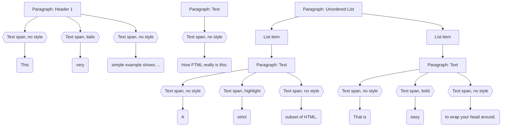

_Warning: This is a work in progress. The specification is not final and this repository really only is public because I'm using the library as a dependency in some other projects._

# FTML – Formatted Text Markup Language

A WIP specification (and Go library) of a HTML-compatible text markup language which only contains the most basic formatting options.

## Introduction

FTML is text markup language which is designed to offer humans a way to express themselves better than plain text, but without the complexity of HTML, Markdown, or other document formats. An FTML file makes no assumptions about how the rendered text will look like, but only about the structure of the text. The format covers typical simple text documents, such as emails, memos, notes, online help, and is specifically suitable for copy-pasting text from one document to another.

It is designed to be a subset a very strict subset of HTML5, in order for software to have a very simple abstract syntax tree to work with and make it easy to embed FTML into HTML documents where needed.

## Description

An FTML file consists of a sequence of block-level elements: text paragraphs, headers (three levels), lists (ordered or unordered), and blockquotes. Headers and text paragraphs contain a sequence of text spans. A text span has an optional style (bold, italic, highlight, underline, strike, link, code) and contains either a sequence of children spans or a text node.

This way, documents with arbitrary indentation, line breaks, and other formatting can easily be represented.

## Example

The following example shows a simple FTML file:

```ftml
<h1>This <i>very</i> simple example shows ...</h1>
<p>How FTML really is this:</p>
<ul>
  <li><p>A <mark>strict</mark> subset of HTML,</p></li>
  <li><p>That is <b>easy</b> to wrap your head around.</p></li>
</ul>
```

The example will be typically represented to the user like this:

> #### This _very_ simple example shows ...
>
> How FTML really is this:
>
> - A <mark>strict</mark> subset of HTML,
> - That is <b>easy</b> to wrap your head around.

And the syntax tree representation of the example looks roughly like this:



## Design goals

- The features supported need to be limited enough to ensure it cannot be abused to create stylized documents.
- The file format needs to be easily diffable—even for tools that are not aware of the file format.
- Try to reduce ambiguity as much as possible. There should usually be exactly _one_ way of expressing something in FTML.
- Must be upwards compatible to HTML 5 (not as full documents, but the FTML needs to be embeddable into a HTML5 file as is)

## Implementation hints

### Extending the format

While exending the format is certainly possible, it should be done completely separate from the actual FTML format. An example would be a word processor which can save files with additional features to the ones supported by FTML. In this case, the file format must be called differently and for copy-pasting into FTML files, the additional features must be stripped, etc.

## Differences to Enriched Text Format (text/enriched or text/richtext)

The text/enriched MIME type is a text format was designed with parsing simplicity and extensibility in mind. It is a line-oriented format, where each line can contain a single formatting command. The format is designed to be easily human-readable and human-writable, and is designed to be easily parsed by software.

### Non-goals

- Support for:
  - Tables
  - Embedded images
  - Checklists
  - Colors
  - Font families
- Automatic replacing of emoji, quotes, arrow symbols, dashes, etc.
- Ease of editing for humans
- Support for other chartsets than UTF-8

### Potential goals which are not decided, yet

- Code blocks
- Links
- Footnotes

### TODO

- How to set up Prettier
- How to set up Visual Studio Code/Vim/Emacs
  - Live Preview: https://marketplace.visualstudio.com/items?itemName=ms-vscode.live-server

### Prior art

- [RFC 1896](https://datatracker.ietf.org/doc/html/rfc1896): The text/enriched MIME Content-type
- [Enriched Text Format -- A Primer](http://users.starpower.net/ksimler/eudora/etf.html): Some more information about `text/enriched`; including a list of compatible clients

### References

- [Unicode Spaces](https://jkorpela.fi/chars/spaces.html): What lead to using EMSP14 as non-collapsing white-space entity in FTML files.
